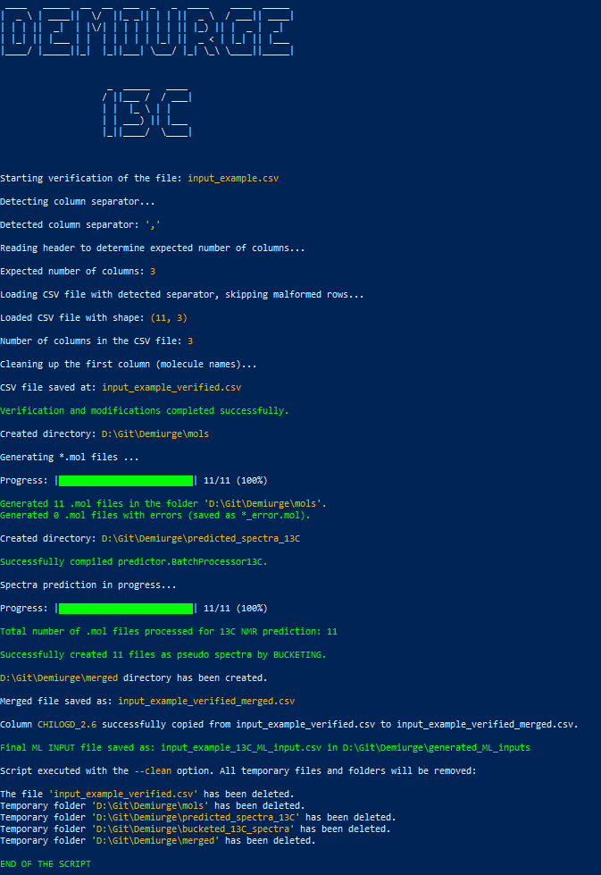
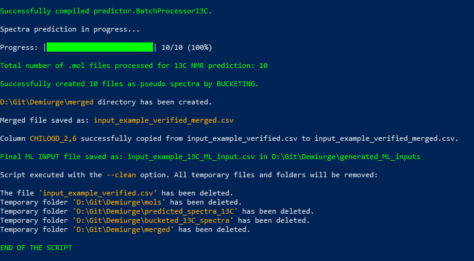

# DEMIURGE

## NMR or ECFP4-based Machine Learning Input Generator

This project provides a comprehensive pipeline for generating machine learning inputs based on feature space derived from **<sup>1</sup>H**, **<sup>13</sup>C NMR spectra** or **ECFP4 Fingerprints**. The software reads a CSV file containing chemical compound names and their SMILES codes, processes the information to generate NMR spectra or ECFP4 Fingerprints, and merges the results with a target property to create a final dataset suitable for machine learning applications.

The tool uses the NMRshiftDB2 predictor, which can be accessed [here](https://sourceforge.net/p/nmrshiftdb2/wiki/PredictorJars/).

## 🖥 Examples of Working Program

The script was run as an example for the prediction of 13C NMR spectra with an input file containing a misdefined one of the rows. In addition, a comma was inserted as the decimal separator and a semicolon was inserted as the column separator.

<p align="center"></p>
<p align="center"></p>

## 📑 Table of Contents
1. [DEMIURGE](#demiurge)
2. [NMR or ECFP4-based Machine Learning Input Generator](#nmr-or-ecfp4-based-machine-learning-input-generator)
3. [🖥 Examples of Working Program](#-examples-of-working-program)
4. [💡 Key Features](#-key-features)
5. [✅ Requirements](#-requirements)
6. [⚙️ Installation](#️-installation)
7. [🗂 Directory Structure](#-directory-structure)
8. [🚀 Usage](#-usage)
9. [📄 Command Line Arguments](#-command-line-arguments)
10. [📄 Example Usage](#-example-usage)
11. [📄 Input CSV Format](#-input-csv-format)
12. [⚙️ Script Workflow for NMR-based Output Data (1H / 13C)](#️-script-workflow-for-nmr-based-output-data-1h--13c)
13. [⚙️ Script Workflow for ECFP4-based Output Data (FP)](#️-script-workflow-for-ecfp4-based-output-data-fp)
14. [🛠 Troubleshooting](#-troubleshooting)
15. [📜 License](#-license)

## 💡Key Features

- **Molecule Generation**: Converts SMILES codes into 3D molecular structures and saves them as flattened 2D `.mol` files using RDKit.
- **NMR Spectrum Prediction**: Predicts NMR spectra for each molecule using a custom Java-based [NMRshiftDB2](https://sourceforge.net/p/nmrshiftdb2/wiki/PredictorJars/) predictor.
- **ECFP4 Fingerprints Generation**: Generates feature space using ECPF4 fingerprints with radius 2. (activated via --predictor FP)
- **Bucketization**: Converts predicted NMR spectra into a uniform matrix using a bucketing technique.
- **Data Merging**: Merges the bucketized spectra/fingerprints with property labels to form a consolidated dataset.
- **Label Insertion**: Adds a target property column to the merged dataset based on a specified label column.
- **Custom Headers**: Adds headers to the final dataset for easy identification and readability.
- **Optional Cleanup**: Deletes all intermediate files and folders to save space and reduce clutter.

## ✅ Requirements

**Important**: The script was tested under **Windows 10** using **PowerShell** and works reliably in this environment on **Python 3.11.4**. It has **not** been tested on Linux or other operating systems.

Ensure the following software and libraries are installed:

1. **Python Libraries**:
   - `rdkit`
   - `pandas`
   - `numpy`
   - `art`
   - `tqdm`

   ```markdown
   Install the required Python packages using:
   ```

   ```bash
   pip install rdkit pandas numpy tqdm art
   ```
   or predefined Python script, which will check if the necessary libraries are installed. If not it will install them:

   ```bash
   python install_modules.py
   ```
   
3. **Java SDK**:
   - Java Development Kit (JDK) is required to compile and run the Java batch processor for NMR spectrum prediction. Make sure the `javac` and `java` commands are available in your system's PATH.

## ⚙️ Installation

Clone the repository from GitHub and navigate to the project directory:

```bash
git clone https://github.com/Prospero1988/Demiurge.git
cd Demiurge
```

### 🗂 Directory Structure

The project is organized into the following directories and files:

```
demiurge/
│
├── demiurge.py                    # Main script for executing the pipeline
├── input_example.csv              # Example of the input file
├── install_modules.py             # Installs required Python packages
├── predictor/
│   ├── predictorh.jar             # Java-based predictor for 1H spectra [NMRshiftDB2]
│   ├── predictor13C.jar           # Java-based predictor for 13C spectra [NMRshiftDB2]
│   ├── cdk-2.9.jar                # CDK library required for spectrum prediction.
│   ├── BatchProcessor1H.java      # Java batch processor for 1H spectra [NMRshiftDB2]
│   └── BatchProcessor13C.java     # Java batch processor for 13C spectra [NMRshiftDB2]
├── logD_predictor_bin/            # Directory containing helper modules
│   ├── csv_checker.py             # Verifies and preprocesses CSV files
│   ├── gen_mols.py                # Generates .mol files from SMILES strings
│   ├── bucket.py                  # Buckets NMR spectra
│   ├── merger.py                  # Merges bucketed spectra CSVs
|   ├── labeler.py                 # Adds labels to the merged spectra file.
│   ├── custom_header.py           # Adds custom headers to the final dataset
│   ├── fp_generator.py            # ECFP4 Fingerprints generator
│   └── model_query.py             # Queries machine learning models
└── README.md                      # Project documentation (this file)
```

## 🚀 Usage

To run the script, use the following command:

```bash
python demiurge.py --csv_path <input_csv_file> --predictor <NMR_type> --label_column <column_number> [--clean]
```

### 📄 Command Line Arguments

- `--csv_path`: **[Required]** Path to the input CSV file containing compound names and SMILES codes.
- `--predictor`: **[Required]** Specifies the type of predictor to use: (`1H` or `13C`) for NMR predictions or (`FP`) for ECFP4 Fingerprints.
- `--label_column`: **[Required]** The column index (1-based) in the input CSV file that contains the target property values.
- `--clean`: **[Optional]** If set, the script will delete all intermediate temporary files and folders after execution.

### 📄 Example Usage

```bash
python demiurge.py --csv_path test.csv --predictor 1H --label_column 3 --clean
```

In this example:
- The script will read the input CSV file `test.csv`.
- It will generate `.mol` files for each molecule based on its SMILES code.
- It will predict the 1H NMR spectra for each molecule.
- The spectra will be bucketized and merged into a single file.
- The target property values from `column 3` in `test.csv` will be added as labels.
- All intermediate files and directories will be deleted after execution due to the `--clean` option.

```bash
python demiurge.py --csv_path test.csv --predictor FP --label_column 3 --clean
```

In this example:
- The script will read the input CSV file `test.csv`.
- It will generate `.mol` files for each molecule based on its SMILES code.
- It will calculate ECFP4 fingerprints for each molecule using RDKit.
- The fingerprint matrix will be merged with the target property values from `column 3` in `test.csv`.
- All intermediate files and directories will be deleted after execution due to the `--clean` option.

### 📄 Input CSV Format

The input CSV file should have at least the following columns:
- `MOLECULE_NAME`: The name or identifier of the molecule.
- `SMILES`: The SMILES code of the molecule.
- `<Label>`: The property values to be modeled (must be specified in the `--label_column` parameter).

Example `test.csv`:

| MOLECULE_NAME | SMILES          | Label |
|---------------|-----------------|-------|
| Compound1     | CCCO            | 5.3   |
| Compound2     | CCC(=O)O        | 2.1   |
| Compound3     | CCN(CC)CC       | 7.8   |

### ⚙️ Script Workflow for NMR-based Output Data (1H / 13C)

1. **Step 1: Generate `.mol` Files**:
   - Reads SMILES codes from the input CSV file and generates corresponding `.mol` files using RDKit.

2. **Step 2: Predict NMR Spectra**:
   - Uses the Java-based `BatchProcessor1H` or `BatchProcessor13C` to predict NMR spectra for each molecule. Predictor is part of [NMRshiftDB2](https://sourceforge.net/p/nmrshiftdb2/wiki/PredictorJars/) database.

3. **Step 3: Bucketize Spectra**:
   - Converts the predicted spectra into a uniform bucketized matrix for easy analysis and machine learning input generation.

4. **Step 4: Merge Spectra and Labels**:
   - Merges the bucketized spectra with the specified label column from the input CSV file.

5. **Step 5: Add Custom Headers**:
   - Adds descriptive headers to the final merged CSV file, making it easier to interpret and use for machine learning tasks.

6. **Step 6: Cleanup (Optional)**:
   - Deletes all intermediate files and directories if the `--clean` option is specified.

### ⚙️ Script Workflow for ECFP4-based Output Data (FP)

1. **Step 1: Generate `.mol` Files**  
   - Reads SMILES strings from the input CSV file and converts them into 2D `.mol` files using RDKit.

2. **Step 2: Calculate ECFP4 Fingerprints**  
   - For each molecule, extended-connectivity fingerprints (ECFP4) are generated from the `.mol` structures using the RDKit implementation.

3. **Step 3: Merge Fingerprints and Labels**  
   - Merges the computed ECFP4 vectors with the label column (e.g., logD values) from the input CSV file into a unified DataFrame.

4. **Step 4: Add Custom Headers**  
   - Assigns descriptive headers to the final CSV file, improving interpretability and downstream machine learning usability.

5. **Step 5: Cleanup (Optional)**  
   - Deletes all intermediate files and directories if the `--clean` flag is used.


## 🛠 Troubleshooting

1. **Java Compilation Issues**:
   - Ensure that the `javac` and `java` commands are available and the Java SDK is installed.
   - If `javac` is not recognized, check the system's `PATH` variable and make sure it includes the path to the JDK `bin` directory.

2. **Missing Dependencies**:
   - Ensure that all required Python libraries (`rdkit`, `pandas`, and `numpy`) are installed.

3. **File Not Found Errors**:
   - Verify the paths to input files and directories. Ensure that the input CSV file and other necessary files are correctly specified.

4. **Memory or Performance Issues**:
   - If handling a large dataset, consider increasing the memory allocation for the Java runtime by adjusting the `-Xmx` parameter in the script.

## 📜 License

This project is licensed under the MIT License - see the [LICENSE](LICENSE) file for details.

---

📖 For detailed background and scientific context, see the accompanying publication:  
(placeholder for DOI and link after publication)
